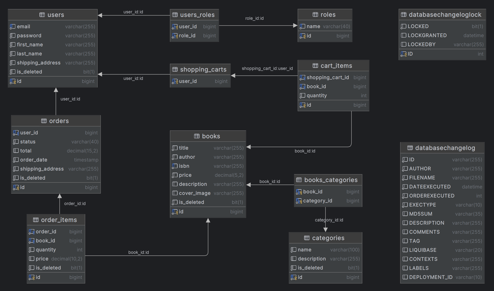

# Online book store
___
Welcome to the online bookstore management system! 
This application provides a convenient experience 
for both buyers and managers. Customers can register, 
view available books, add books to cart, manage cart, 
and create an order based on the cart. Managers, in turn, 
can easily manage books, categories and customer orders. <br>
Security is arranged using reliable authentication and 
authorization functions using JWT tokens
___

## Technologies
<ul style="list-style: none">
 <li> Java 17</li>
 <li> Maven</li>
 <li> Spring framework <i><small>(boot, data, security)</small></i> </li>
 <li> Lombok</li>
 <li> MapStruct</li>
 <li> MySql 8</li>
 <li> Hibernate</li>
 <li> Liquibase</li>
 <li> JUnit5 <i><small>(+ Mockito)</small></i></li>
 <li> Docker</li>
 <li> Swagger</li>
</ul>

___

## Getting Started

1. Make sure you have installed
<ul style="list-style: none">
 <li> JDK 17+</li>
 <li> Docker</li>
</ul>

2. Clone repository
```text
git clone https://github.com/Oleksandr-Tymoshenko/Online-Book-Store.git
```
3. Create .env file with variables
```text
MYSQLDB_ROOT_PASSWORD=
MYSQLDB_DATABASE=
MYSQLDB_LOCAL_PORT=
MYSQLDB_DOCKER_PORT=
SPRING_LOCAL_PORT=
SPRING_DOCKER_PORT=
DEBUG_PORT=
MYSQLDB_USER=
JWT_SECRET=
JWT_EXPIRATION_MINUTES=
JWT_EXPIRATION_HOURS=
```

4. Run the following command to build and start the Docker containers
```text
docker-compose up --build
```

5. The application should now be running at `http://localhost:8081`.

___

## Domain Models
#### User
* Attributes: Contains comprehensive information about registered users, including authentication details and personal information.
* Roles: Users are assigned roles, such as admin or regular user, defining their permissions and access levels.
#### Role
* Purpose: Represents the role of a user within the system, playing a crucial role in defining their access and actions.
#### Book
* Attributes: Represents detailed information about a book available in the store, including title, author, price, and category.
#### Category
* Purpose: Represents a category to which a book can belong, contributing to effective organization and user navigation.
#### ShoppingCart
* Purpose: Represents a user's shopping cart, capable of containing multiple items (CartItems).
#### CartItem
* Attributes: Represents an item in a user's shopping cart, linked to a specific book.
#### Order
* Purpose: Represents an order placed by a user, encapsulating OrderItems.
#### OrderItem
* Attributes: Represents an item in a user's order, associated with a specific book.
___
## User Roles
#### Shopper (User)
* Actions: Capable of joining, signing in, exploring books, searching, managing the shopping cart, placing and reviewing orders, and accessing past receipts.
#### Manager (Admin)
* Actions: Empowered to arrange books, organize bookshelf sections, manage receipts, and modify their status.
___
## Database structure

___
## Endpoints
#### Authorization
| **HTTP method** | **Endpoint**               | **Role** | **Description**                                                   |
|:----------------|:---------------------------|----------|:------------------------------------------------------------------|
| POST            | /api/auth/register         |          | Register a new user to the system                                 |
| POST            | /api/auth/login            |          | Login with email and password. Response - JWT token               |

#### Book management
| **HTTP method** | **Endpoint**               | **Role** | **Description**                                                   |
|:----------------|:---------------------------|----------|:------------------------------------------------------------------|
| GET             | /api/books                 | USER     | Get all books per website pages                                   |
| GET             | /api/books/{id}            | USER     | Get the book by its id number                                     |
| GET             | /api/books/search          | USER     | Search books by title and author *(titles=values&authors=values)* |
| POST            | /api/books                 | ADMIN    | Create a new book                                                 |
| PUT             | /api/books/{id}            | ADMIN    | Update the book by its id number                                  |
| DELETE          | /api/books/{id}            | ADMIN    | Delete the book by its id number *(soft-delete)*                  |

#### Categories management
| **HTTP method** | **Endpoint**               | **Role** | **Description**                                                   |
|:----------------|:---------------------------|----------|:------------------------------------------------------------------|
| GET             | /api/categories            | USER     | Get all categories per website pages                              |
| GET             | /api/categories/{id}       | USER     | Get the category by its id number                                 |
| GET             | /api/categories/{id}/books | USER     | Get list of books by the category by its id number                |
| POST            | /api/categories            | ADMIN    | Create a new category                                             |
| PUT             | /api/categories/{id}       | ADMIN    | Update the category by its id number                              |
| DELETE          | /api/categories/{id}       | ADMIN    | Delete the category by its id number *(soft-delete)*              |

#### Shopping cart management
| **HTTP method** | **Endpoint**               | **Role** | **Description**                                                   |
|:----------------|:---------------------------|----------|:------------------------------------------------------------------|
| GET             | /api/cart                  | USER     | Get shopping cart                                                 |
| POST            | /api/cart                  | USER     | Add a new book to shopping cart                                   |
| PUT             | /api/cart/cart-items/{id}  | USER     | Endpoint for updating quantity of an item in shopping cart        |
| DELETE          | /api/cart/cart-items/{id}  | USER     | Delete book from shopping cart by id                              |

#### Order management
| **HTTP method** | **Endpoint**                    | **Role** | **Description**                                                           |
|:----------------|:--------------------------------|----------|:--------------------------------------------------------------------------|
| POST            | /api/orders                     | USER     | Place an order based on your shopping cart, then shopping cart is deleted |
| GET             | /api/orders                     | USER     | Get all orders for user                                                   |
| GET             | /api/orders/{id}/items          | USER     | Get all order items by order id                                           |
| GET             | /api/orders/{id}/items/{itemId} | USER     | Get info about order item by order id and item id                         |
| PATCH           | /api/orders/{id}                | ADMIN    | Update order status for order by id                                       |

#### More detailed information about request bodies you can find by endpoint below
http://localhost:8081/swagger-ui/index.html#/
___